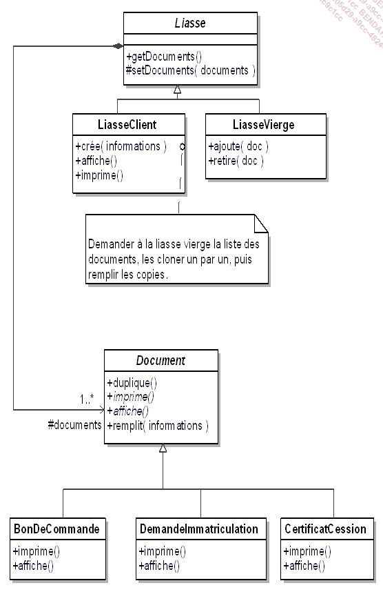
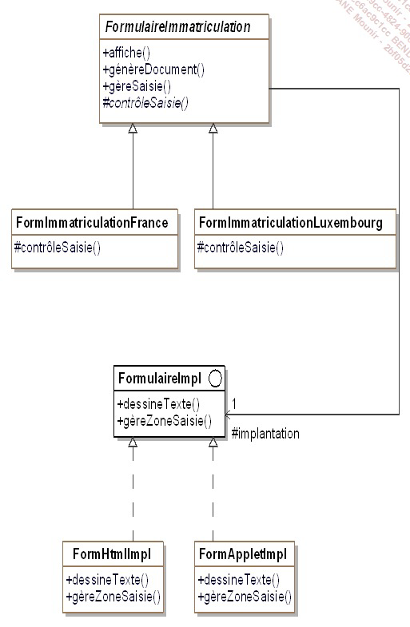
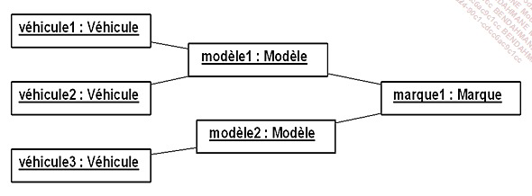

# Design Pattern C# :

## Création projet .NET console

dotnet new console -o consoleApp

## Lancer l'application consoleApp

dotnet run 

Design Pattern Théorie : 

DP --> rôle optimiser les solutions et répondre à des besoins spé 
   --> Bonne pratique utiliser 

MVC <-> Model Vue Controller 
Singleton <-> Angular one instance

## Description des Patterns

-name
-desc
-exemple de code sous forme de diagramme UML
-la structure standard (abstraite)
-exemple de code 

## Cas concret d'etudes pour ce cours 

Nous allons prendre en exemple le cas d'une societe qui vend des vehicules en ligne

## Première grande famille de Design Pattern : les patterns de construction 

-la façon de crée des obj/classe normalisé des classe par le bias d'interface pour interagir "avec un seul instance par exempleavec singleton"  

### Le pattern Abstract Factory :

 -objectif fournir une interface pour créer des familles d'objets liés sans spécifier leurs classes concrètes.

 - exemple :  Catalogue -- une instance qui va implémenté une instance de Fabrique vehicule (Famille d'objet) -1-> FabriqueVehicule <- (scooter,..)

 

 ### Le pattern Builder :

 -Il permet de construire des objets complexes étape par étape, en séparant la construction/implémentation de l'objet final de sa représentation.

 

 ### Le pattern Factory Method :

 Le pattern Factory Method est un pattern qui permet de déléguer la création d'objets à des sous-classes. Il définit une interface commune pour créer des objets, mais laisse les sous-classes décider quelles classes concrètes instancier.

 -exemple : gestion ligne de fabrication 

 

  ### Le pattern Singleton :

  2 choses pour mettre en place le pattern singleton :
       - une classe ne doit possédé qu'une seul instance 
       - il faut créer une methode de classe qui permet de fournir cette unique instance 
à noté : ce pattern est applicable à d'autre pattern  

  ### Le pattern Prototype  :

Le pattern prototype est un modèle de conception qui permet de créer de nouvelles instances d'un objet en copiant un objet existant, plutôt qu'en le recréant à partir de zéro. Cela permet d'économiser du temps et des ressources en évitant de recréer manuellement chaque aspect de l'objet.

## Introduction aux patterns de structuration 

L’objectif des patterns de structuration est de faciliter l’indépendance de l’interface d’un objet ou d’un
ensemble d’objets vis-à-vis de son implantation. Dans le cas d’un ensemble d’objets, il s’agit aussi de
rendre cette interface indépendante de la hiérarchie des classes et de la composition des objets.
En fournissant les interfaces, les patterns de structuration encapsulent la composition des objets,
augmentant le niveau d’abstraction du système à l’image des patterns de création qui encapsulent la
création des objets. Les patterns de structuration mettent en avant les interfaces.
L’encapsulation de la composition est réalisée non pas en structurant l’objet lui-même mais en transférant
cette structuration à un second objet. Celui-ci est intimement lié au premier objet. Ce transfert de
structuration signifie que le premier objet détient l’interface vis-à-vis des clients et gère la relation avec le
second objet qui lui gère la composition et n’a aucune interface avec les clients externes.

### Le pattern adaptater :

Permet de faire collaborer des classes ayant des interfaces incompatibles en les enveloppant dans une classe adaptateur. L'adaptateur agit comme une interface intermédiaire entre deux classes afin de convertir l'interface d'une classe en une autre interface attendue par le client. Il facilite l'intégration de classes existantes dans un système sans avoir à modifier leur code source.

### Le pattern Décorator :

Içi on cherche a ajouter des feature supp a un objet en prenant soin de ne pas modifier son interface. Toute modif apporrt parce pattern seront transparentes vis-à-vis des clients. Ce pattern constitue une alternative a la creation de sous classe pour enrichir les fonctionnalité d'un objet 

domaine utiliser 
- notre application souhaite ajouter dynamiquement des fonctionnalité a un objet sans modifier son interface
- une application doit gerer des fonctionalité qui peuvent être retirees dynamiquement 
- l'utilisation de l'heritage n'est pas une option car la hiérarchie d'objet est deja trop complexe  

### Le Pattern Bridge 

### le pattern composite

### le pattern de comportement

TODO => ajouter la definition 

